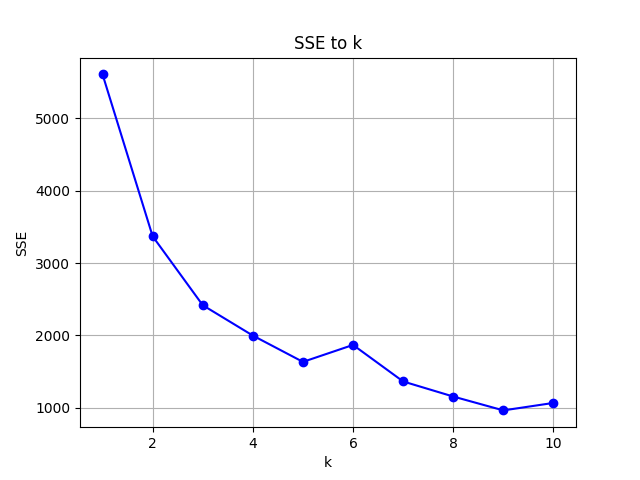

# Clustering 
**Author(s):** Luca Stoltenberg & Philip Langenbrink<br/>
**Python Version:** 3.9.7<br/>
**For**: An Introduction to Python using Data Science<br/>
**Date of hand in:** 2025-09-10 - 19:00<br/>

---

## Task 2.1
### Task 2.1.2 iii
Make a new dataset again consisting of 3 clusters but with some overlap so that they cannot
be perfectly distinguished visually. Perform the same procedure as above. Is the outcome
different? If so, how?
```python
import generator as gen

array_points = gen.N_clouds(3, 500, [[5.0, 5.0], [5.0, 0.0], [0.0, 5.0]],
                [[[1.0, 0.0], [0.0, 1.0]], [[1.0, 0.0], [0.0, 1.0]], [[1.0, 0.0], [0.0, 1.0]]])
```
> The outcome is different, the clusters are not perfectly distinguishable because of the overlap.
> This is because the k-means algorithm does not always find the best solution for this data set


### Task 2.1.3 iii
Apply this to both your datasets with k_max = 10 and plot the SSE values as line plots. Can
you observe the elbows of these curves? What value of k do they correspond to? How do
the two datasets compare?


> The SSE decreases with increasing k both datasets have very similar curves

### Task 2.1.4 ii
Apply this function to an overlapping point cloud data set. Do you notice the same amount of
variability in the output?
> The clouds overlap more here, so the k-means algorithm has more problems clustering them correctly

## Task 2.2
### Task 2.2.1 ii 
Visualize the data as a scatter plot. Take a moment to check why this data set is non-convex.
> The data set is non-convex because it consists of two interlocking half-circles, which cannot be separated by a straight line.

### Task 2.2.1 iii
Can you distinguish any clusters visually? If so, how many?
> Yes, there are two clusters that can be distinguished.

### Task 2.2.1 v
Do the results match your expectation?
> No the results do not match the expectation. 

### 